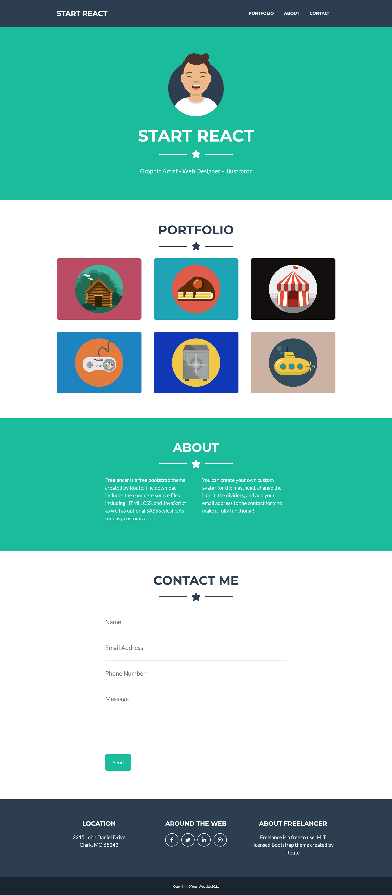

# Start React (route-assignment-14)

This is my work assigned by [Route-Academy](https://www.linkedin.com/company/routeacademy/mycompany/) during learning front-end web development.

## Table of contents

- [Screenshot](#screenshot)
- [Links](#links)
- [Author](#author)

### Screenshot

### Links

- Solution URL: [Code](https://github.com/IMostafaR/start-react)
- Live Demo: [Demo](https://imostafar.github.io/start-react/)

## Author

- GitHub - [IMostafaR](https://github.com/IMostafaR)
- Linkedin - [@imostafarh](https://www.linkedin.com/in/imostafarh/)
